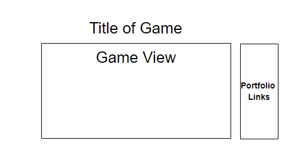

# Gun Runner
A browser game by Nick Draper

## Backgound
Gun Runner is a sidescroller shooter where the player is able to jump over objects and shoot at enemies to clear their path. The player's character is static while the world moves towards them, having the player dodge incoming obsticles by jumping and shooting detroyable objects. 

## Functionality & MVP
In this browser game, players will be able to:
* Controll the character, including jumping and shooting
* View local and global highscores after game over
* Start, pause, and reset the game

In Addition, the project will include:
* An About section describing the background, rules, and controls of the game'
* A production README

## Wireframes
The app will consist of a single game view, where most of the information will be displayed. On arrival, the game view will display information about the game, including instructions, controls, and a background. On start of the game, the information will be replaced by the game, the environment moving left and the player staying stationary, giving the illusion of player movement towards the right. On game over, the game view will show the players score along with local high scores and global highscores. The player will have the option to log their nickname to input their highscore. On the right side of the game view there will be links to my LinkedIn, GitHub, and other sites to display more information about myself.

## Architecture and Technologies
This project will be constructed with the following technologies:
* `JavaScript` for the game logic
* `HTML Canvas` for rendering objects on the game view
* `Webpack` to bundle js files

In addition to the entry file, there will be multiple scripts involved in this project:
* `view.js`: this will be handling the logic for and creating and updating the necessary elements and rendering them to the DOM. Holds instances of `Game`, creates a `canvas` context and installs key listeners to move your player and fire bullets.
* `movingObject.js`: this will handle logic for basic movement of objects that will be moving anywhere inside the game view
* `player.js`: this will handle user input and will be updated based on that user input and interations with other elements. A subclass of `MovingObject`
* `bullet.js`: kills enemies. A `MovingObject` subclass.
* `obsticle.js`: this lightweight script will house the constructor and update functions for `Obsticle` objects. Each `Obsticle` will containe a `type`(enemy or block) and an `aliveState`(`true` or `false`). Also a `MovingObject` subclass.
* `game.js`: Holds general structure, logic and rendering functions for the game

## Implementation Timeline
**Day 1:** Setup all necessary Node modules, including getting webpack up and running. Write a basic entry file and barebones of all scripts outlined above to have general structure of app completed. Goals for the day:
  * Get a basic game view showing so that testing new logic for elements can be seen easily.
  * Complete logic for `MovingObject` so I can move on to subclasses tomorrow

**Day 2:** Dedicate this day to the `MovingObject` subclasses and collision detection. First, build out the player class and be able to jump and fire bullet. Then, start moving obsticles towards the player. Then, create enemies that move up and down whille moving towards the player. Goals for the day:
  * Get all `MovingObject` subclasses to move in the correct ways, and get collision testing to work

**Day 3:** Get the game to procedurally generate. Research how to randomly generate new objects once old ones have moved off the page, and as the player survives for longer, have the obsticles move towards them faster. Goals for the day:
  * Have the general gameplay working 100%. 
  * Have obsitcles move towards the player, enemies can be shot and destroyed, blocks need to be avoided, and new ones render randomly when old blocks and enemies run off the screen left.

**Day 4:** Time to make it pretty. This day will be devoted to making the game as pretty as possible with the use of sprites, css, and other things to make the experience more enjoyable for the user. Goals for the day:
  * Make the interface seamless, responsive, and easy to understand for the user
  * Make the game look *cool*

## Bonus Features
There are many features I would like to implement in the future. Some anticipated updates are: 
* Leaderboard (local and global)
* Pickup different weapons that have different bullet properties (shotgun/missle launcher)
* Tiered levels, meaning the player can jump up onto platforms and clime vertically.