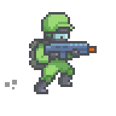
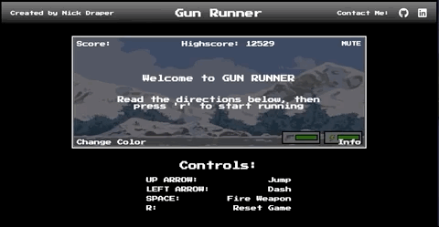

# [Gun Runner](https://nickdraper8.github.io/gun-runner/): A browser game by Nick Draper



## Background
Gun Runner is a sidescroller shooter where the player is able to jump over objects and shoot at enemies to clear their path. The player's character is static while the world moves towards them, having the player dodge incoming obsticles by jumping over indestructable trees and shooting detroyable enemies flying above.

<br><br/>
<p align="center"></p>
<br><br/>

## Architecture and Technologies
This project was constructed with the following technologies:
* `JavaScript` for the game logic
* `HTML Canvas` for rendering objects on the game view
* `CSS` to give some style to the UI and website holding the canvas
* `Webpack` to bundle js files

In addition to the entry file, there are multiple scripts involved in this project:
* `game_view.js`: this handles the logic for and creating and updating the necessary elements and rendering them to the DOM. Holds instances of `Game`, creates a `canvas` context and installs key listeners to move your player and fire bullets.
* `moving_object.js`: this handles logic and drawing for basic movement of objects that will be moving anywhere inside the game view.
* `animated_object.js`: this handles logic and drawing for objects that will be animated using sprite sheets. A subclass of `MovingObject`.
* `static_sprite_object.js`: This handles logic and drawing for objects that are not animated but are drawn using an image file. A subclass of `MovingObject`.
* `player.js`: this handles user input and is updated based on that user input and interations with other elements. A subclass of `AnimatedObject`.
* `bullet.js`: kills enemies. A `MovingObject` subclass.
* `obsticle.js`: this lightweight script houses the constructor and update functions for `Obsticle` objects. A `StaticSpriteObject` subclass.
* `enemy.js`: this script houses the constructor and update functions for `Enemy` objects. An `AnimatedObject` subclass.
* `game.js`: holds general structure, logic and rendering functions for the game

## Technical Challenges
I faced several challenges when building this project, here are a few examples.

### Animating Sprites
This was more difficault than I anticipated, but I knew having animated sprites in my game was a must to give a real retro arcade atmosphere to my game. After finding a few nice looking sprite sheets online, I went to work researching how to animate sprites using HTML Canvas. 
I ended up creating a new subclass of `MovingObject` called `AnimatedObject`, that would have its own `draw` method. Instead of drawing a square representing the object, it would instead draw the chosen image onto the canvas. Here is the code to draw the images:
```
// animated_object.js
    drawFrame(ctx, frameX, frameY, canvasX, canvasY) {
            ctx.drawImage(this.currentImage,
                            frameX * this.spriteWidth, frameY * this.spriteHeight, this.spriteWidth, this.spriteHeight,
                            canvasX, canvasY, this.scaledWidth, this.scaledHeight);
        }

        draw(ctx) {
            this.frameCount += 1;
            this.drawFrame(ctx, this.cycleLoop[this.currentLoopIndex], 0, this.pos[0]-this.xOffset, this.pos[1]-this.yOffset);
            if (this.frameCount < this.fps){
                return
            } else {
                this.frameCount = 0;
                this.currentLoopIndex++;
                if (this.currentLoopIndex >= this.cycleLoop.length) {
                    this.currentLoopIndex = 0;
                }
            }
        }
```
In `draw`, it keeps track of the `frameCount` and `currentLoopIndex` to decide what frames to draw and when to move to the next frame, creating the illusion of movement. `drawFrame` takes in the `currentLoopIndex` to know where to crop the sprite sheet, the context for the canvas, and the position on the canvas to draw the image.

Furthermore, each sprite I used had different sizes, number of frames, etc. So I had to add a few extra variables in each class that used a specific sprite sheet so that I could use this function for any new `AnimatedObject` I wanted to add, and have the image be drawn on the page in the right spot, the right size and the right framerate. Here is the set up for the `Enemy` class:
```
// enemy.js
class Enemy extends AnimatedObject {
    constructor({ vel = [-10,0], color = '#B91C9C', height = 70, width = 40, scale = 1}) {
        super({vel, color, height, width, scale});

        this.setupImages();
        this.cycleLoop = [0,1,2,3,4,5,6,7,8,9,10,11,12,13,14,15,16,17,18,19,20,21,22,23];

        this.spriteHeight = 90;
        this.spriteWidth = 91;
 
        this.scaledHeight = this.scale * this.spriteHeight;
        this.scaledWidth = this.scale * this.spriteWidth;
        
        this.xOffset = 10;
        this.yOffset = 5;

        this.fps = 8;

    }

    setupImages() {
        this.idleImg = new Image();
        this.idleImg.src = "/images/Plasma_Drone_Idle.png";
        this.explodeImg = new Image();
        this.explodeImg.src = "/images/Plasma_Drone_Explode.png";

        this.currentImage = this.idleImg;
    }

    collideWith(otherObject) {
        if (this.currentImage === this.idleImg) {
            if (otherObject instanceof Player) {
                // console.log("Player collision with enemy")
                return "gameover"
            } else if (otherObject instanceof Bullet) {
                // console.log("enemy explodes")
                document.getElementById("explosion").currentTime = 0;
                document.getElementById("explosion").play();
                this.currentImage = this.explodeImg;
                this.spriteHeight = 190;
                this.spriteWidth = 190;
                // this.cycleLoop = [0,1,2,3,4,5];
                this.currentLoopIndex = 0;
                this.scaledHeight = this.scale * this.spriteHeight;
                this.scaledWidth = this.scale * this.spriteWidth;
                this.xOffset = 60;
                this.yOffset = 60;
                otherObject.remove();
                // debugger
                return "enemykill";
            }
            return false;
        }
    };
```
Notice in `collideWith`, if the enemy is detroyed by a bullet, I change it's image to the exploding sprite sheet and change the variables used to determine how to draw it, since the size and amount of frames is different than the idle sprite sheet. This same strategy is done for the `player` class when jumping.

### Unpredictable Object Movement
I noticed that when I was first building out my `move` function for `MovingObjects`, all my objects seemed to be moving way too fast, and there seemed to be times when objects sped up or slowed down if my computer was heating up and becoming more busy. After some research and closer inspection of my code, I found out that between each animation frame the time would be longer or shorter between moves, which was causing this unpredictable movement. It seemed the answer was to create a `timeDelta` variable, which is the time now substracted by the time since the last animation frame. I create this variable in `game_view.js` and pass it through `game.js` to my `move` function in `moving_object.js`.
```
// game_view.js
    animate(time) {
            if (!this.game.gameover) {
                const timeDelta = time - this.lastTime;

                this.game.step(timeDelta);
                this.game.draw(this.ctx);
                this.lastTime = time;

                requestAnimationFrame(this.animate.bind(this));
```
```
// game.js
    step(delta) {
            this.moveObjects(delta);
            this.players[0].update();
            this.checkCollisions();

            this.score += 1;
        };
```
```
// moving_object.js
    move(timeDelta) {
        const velocityScale = timeDelta / (1000/60);
        const offsetX = this.vel[0] * velocityScale;
        const offsetY = this.vel[1] * velocityScale;

        this.pos = [this.pos[0] + offsetX, this.pos[1] + offsetY];
        if (this.game.isOutOfBounds(this.pos)) {
            this.remove();
        }
    }
```
In `move`, I use the `timeDelta` variable (which is the number of milliseconds since the last move) to determine the correct velocity of how far an object should move in a 60th of a second. If the computer is busy `timeDelta` should be larger, and if it is not busy it should be smaller. This allowed for more predictable movements of my objects across the screen regardless of whether or not the computer is busy or not and the time between frames is not consistent. 

## Moving Forward
In the future, I am going to be working implementing a couple new features. 
- Weapon pickup system that will change the wait time between shooting bullets, or the nature of how the bullets move/fire (shotgun, machine gun, etc.)
- Global Leaderboard. This will involve adding a simple backend and lightweight database, as well as moving the hosting service from GitHub pages to something like Heroku.
- Themed levels. I would like for the background/theme to change when you reach a certain score. For example, at 10,000 points the background changes to a beach theme, enemies are now seagulls and obsticles are sandcastles.

## Assets Used
Here is a list of recourses I used and the sources of where they came from:

### Sprites and Art:
- Enemy sprites
    - https://imonk.itch.io/plasma-drone
- Player sprites
    - https://secrethideout.itch.io/team-wars-platformer-battle
- Background
    - https://www.pinterest.com/pin/466896686362782654/
- Obstacle sprites
    - https://www.pixilart.com/art/slay-the-king-tree-sprite-not-mine-came-from-a-stamp-a8230269374df1
- Gun UI icon
    - https://kaylousberg.itch.io/
- Lightning Bolt UI Icon
    - http://pixelartmaker.com/art/a9f00c9246bf3dd

### Icons
- https://fontawesome.com/

### Sounds
- Victory horns
    - https://freesound.org/people/FunWithSound/sounds/456966/
- Enemy Explosion
    - https://www.freesoundeffects.com/free-sounds/explosion-10070
- All others
    - Royalty free music from https://www.fesliyanstudios.com
